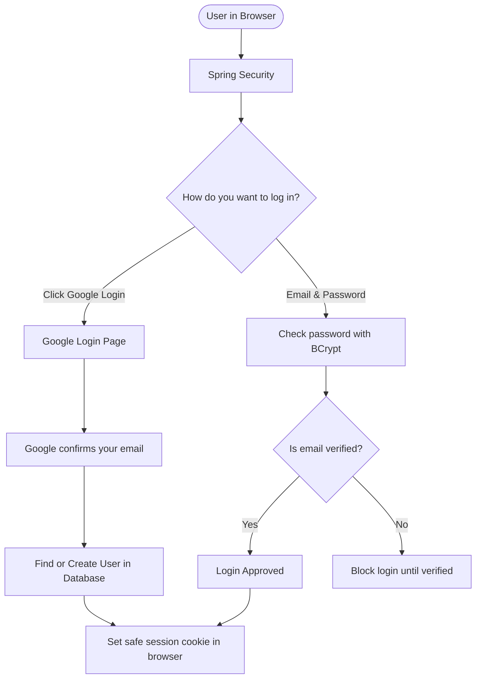
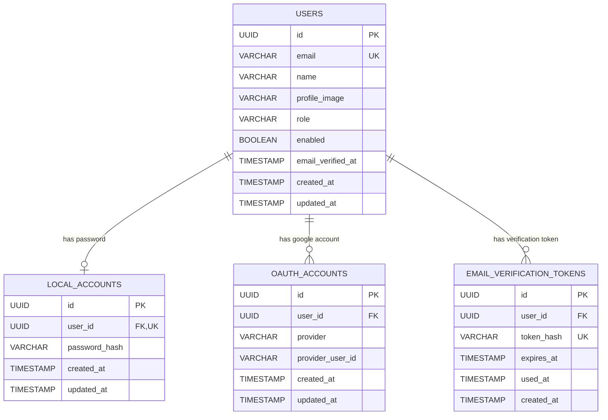

# 🛡️ SecureAuth

[](https://spring.io/projects/spring-boot)
[](https://spring.io/projects/spring-security)
[](https://openjdk.org/)
[](https://www.postgresql.org/)
[](https://developers.google.com/identity)

A secure and clean authentication system built with **Java**, **Spring Boot 3**, **Spring Security 6**, and **PostgreSQL**.

It supports both **Sign in with Google** and standard **Email & Password login**, using safe browser cookies, protection against common web attacks, and email verification.

---

## 📌 Table of Contents

- [What Does This Project Do?](#-what-does-this-project-do)
- [Key Features](#-key-features)
- [How It Works](#-how-it-works)
    - [1. User Account Structure](#1-user-account-structure)
    - [2. Login Flow](#2-login-flow)
- [Security Protections](#-security-protections)
- [Database Tables](#-database-tables)
- [API Endpoints](#-api-endpoints)
- [How to Run It Locally](#-how-to-run-it-locally)
    - [Requirements](#requirements)
    - [Setup Steps](#setup-steps)
- [Project Folders & Files](#-project-folders--files)
- [Roadmap](#-roadmap)

---

## 💡 What Does This Project Do?

Many web apps need a login system. But building one properly means taking care of many security details:
- How do we let users log in with Google without breaking our own database?
- How do we store passwords safely?
- How do we verify that a user actually owns their email?
- How do we protect users from hackers stealing their login cookies?

**SecureAuth** solves these problems step-by-step using modern Spring Boot best practices.

---

## ✨ Key Features

* **Sign in with Google**:
    * Users can log in with one click using their Google account.
    * If the user is new, an account is created automatically.
    * If the user already signed up with the same email, the Google account is automatically linked to their existing profile.

* **Email & Password Signup**:
    * Users can register with their name, email, and password.
    * Passwords must be at least 15 characters long for safety.
    * Passwords are encrypted with BCrypt before being saved. Plain passwords are never stored.

* **Email Verification**:
    * When a user registers, a verification link is sent to their email.
    * Users cannot log in until they click the verification link.
    * The link uses a secure random token. Only the hashed version of the token is saved in the database, so even if the database is leaked, tokens cannot be stolen.

* **Safe Browser Cookies**:
    * Logged-in users get a secure session cookie (`JSESSIONID`).
    * The cookie has `HttpOnly` enabled so JavaScript cannot read or steal it.
    * The cookie uses `SameSite=Lax` to stop cross-site request attacks.
    * Session IDs change after login to prevent session hijacking.

* **CSRF Protection for Frontend Apps (SPA)**:
    * Works smoothly with frontend apps (like React, Vue, or Next.js).
    * Automatically handles anti-forgery tokens (`XSRF-TOKEN`).

---

## 🏗️ How It Works

### 1. User Account Structure

Instead of cramming everything into a single user table, we separate the **User Profile** from their **Login Methods**:

```
                       ┌──────────────────────────────┐
                       │          Main User           │
                       │   (id, email, name, role)    │
                       └──────────────┬───────────────┘
                                      │
              ┌───────────────────────┴───────────────────────┐
              ▼                                               ▼
 ┌─────────────────────────┐                     ┌─────────────────────────┐
 │      Local Account      │                     │      Google Account     │
 │ (Password Hash / BCrypt)│                     │  (Google ID & Provider) │
 └─────────────────────────┘                     └─────────────────────────┘
```

**Why do this?**
This allows the same user to log in with a password **or** with Google without creating duplicate accounts!

---

### 2. Login Flow



---

## 🛡️ Security Protections

Here are the main security safeguards built into the app:

| Protection | What it does | Why it matters |
| :--- | :--- | :--- |
| **BCrypt Password Hashing** | Converts passwords into scrambled hashes before saving. | Even if someone reads the database, they cannot see your actual password. |
| **Hashed Tokens** | Verification tokens sent via email are converted to SHA-256 hashes in the database. | Leaked databases will not expose active email confirmation links. |
| **HttpOnly Cookies** | Prevents JavaScript from reading the session cookie. | Stops malicious scripts (XSS attacks) from stealing user logins. |
| **CSRF Protection** | Ensures requests come from your own frontend. | Stops malicious websites from making hidden actions on behalf of the user. |
| **Session Fixation Defense** | Gives the user a fresh session ID right after logging in. | Prevents attackers from tricking users into using a known session ID. |
| **Standard Error Messages** | Returns clean, uniform error messages (RFC 9457). | Prevents hackers from seeing database errors or system stack traces. |

---

## 🗄️ Database Tables

Here is how the data is stored in PostgreSQL:



---

## 📡 API Endpoints

| Method | URL | Needs Login? | What it does |
| :--- | :--- | :---: | :--- |
| `GET` | `/api/auth/csrf` | No | Gets the CSRF token for frontend forms |
| `GET` | `/oauth2/authorization/google` | No | Starts Google Login in browser |
| `GET` | `/login/oauth2/code/google` | No | Google callback endpoint (handles Google code) |
| `POST` | `/api/auth/register` | No | Registers a new account with email & password |
| `POST` | `/api/auth/login` | No | Logs in with email & password and starts a session |
| `POST` | `/api/auth/logout` | Yes | Logs out the user and clears the session |
| `GET` | `/api/auth/me` | Yes | Returns the logged-in user's details |
| `GET` | `/api/auth/verify-email?token=...` | No | Verifies the user's email using link from inbox |

---

## 💻 How to Run It Locally

### Requirements

1. **Java 17** or **Java 21**
2. **PostgreSQL** (running on your machine or in Docker)
3. A Google Cloud Console project with OAuth credentials (Client ID and Secret)
4. An email account or a test mail tool (like Mailpit or MailHog)

---

### Setup Steps

#### 1. Set Environment Variables
Create an `.env` file or export these variables in your terminal:

```properties
# Database
DB_URL=jdbc:postgresql://localhost:5432/secureauth
DB_USERNAME=postgres
DB_PASSWORD=your_password

# Google OAuth2
GOOGLE_CLIENT_ID=your_client_id.apps.googleusercontent.com
GOOGLE_CLIENT_SECRET=your_client_secret

# Email Sender
MAIL_HOST=smtp.example.com
MAIL_PORT=587
MAIL_USERNAME=your_email_user
MAIL_PASSWORD=your_email_password
MAIL_FROM=no-reply@example.com
```

#### 2. Create the Database Tables
Open your PostgreSQL database tool (like pgAdmin or `psql`) and run this SQL:

```sql
CREATE TABLE users (
    id UUID PRIMARY KEY,
    email VARCHAR(254) NOT NULL,
    name VARCHAR(255) NOT NULL,
    profile_image VARCHAR(1024),
    role VARCHAR(32) NOT NULL DEFAULT 'USER',
    enabled BOOLEAN NOT NULL DEFAULT TRUE,
    email_verified_at TIMESTAMP WITH TIME ZONE,
    created_at TIMESTAMP WITH TIME ZONE NOT NULL,
    updated_at TIMESTAMP WITH TIME ZONE NOT NULL,
    CONSTRAINT uk_users_email UNIQUE (email)
);

CREATE TABLE local_accounts (
    id UUID PRIMARY KEY,
    user_id UUID NOT NULL,
    password_hash VARCHAR(255) NOT NULL,
    created_at TIMESTAMP WITH TIME ZONE NOT NULL,
    updated_at TIMESTAMP WITH TIME ZONE NOT NULL,
    CONSTRAINT uk_local_account_user UNIQUE (user_id),
    CONSTRAINT fk_local_accounts_user FOREIGN KEY (user_id) REFERENCES users(id) ON DELETE CASCADE
);

CREATE TABLE oauth_accounts (
    id UUID PRIMARY KEY,
    user_id UUID NOT NULL,
    provider VARCHAR(32) NOT NULL,
    provider_user_id VARCHAR(255) NOT NULL,
    created_at TIMESTAMP WITH TIME ZONE NOT NULL,
    updated_at TIMESTAMP WITH TIME ZONE NOT NULL,
    CONSTRAINT uk_oauth_provider_user UNIQUE (provider, provider_user_id),
    CONSTRAINT fk_oauth_accounts_user FOREIGN KEY (user_id) REFERENCES users(id) ON DELETE CASCADE
);

CREATE TABLE email_verification_tokens (
    id UUID PRIMARY KEY,
    user_id UUID NOT NULL,
    token_hash VARCHAR(64) NOT NULL,
    expires_at TIMESTAMP WITH TIME ZONE NOT NULL,
    used_at TIMESTAMP WITH TIME ZONE,
    created_at TIMESTAMP WITH TIME ZONE NOT NULL,
    CONSTRAINT uk_email_verification_token_hash UNIQUE (token_hash),
    CONSTRAINT fk_email_verification_tokens_user FOREIGN KEY (user_id) REFERENCES users(id) ON DELETE CASCADE
);
CREATE INDEX idx_email_verification_token_hash ON email_verification_tokens(token_hash);
```

#### 3. Run the App
Open your terminal in the `backend` folder and run:

```bash
# On Windows:
.\mvnw.cmd spring-boot:run

# On Linux / macOS:
./mvnw spring-boot:run
```

The application will start on **`http://localhost:8080`**.

---

## 📂 Project Folders & Files

```text
com.example.secureauth
├── config/
│   ├── CorsConfig.java               # Configures allowed frontend origins
│   └── PasswordConfig.java           # Sets up BCrypt password encoder
├── controller/
│   ├── AuthController.java           # API endpoints (register, login, verify, me)
│   └── CsrfController.java           # Endpoint to provide CSRF token to frontend
├── dto/
│   ├── CurrentUserResponse.java      # Safe user info returned to client
│   ├── LoginRequest.java             # Holds email & password during login
│   └── RegisterRequest.java          # Holds registration data (name, email, password)
├── entity/
│   ├── EmailVerificationToken.java   # Stores hashed verification tokens
│   ├── LocalAccount.java             # Stores password hashes
│   ├── OAuthAccount.java             # Stores Google account links
│   └── User.java                     # Main user identity table
├── exception/
│   └── GlobalExceptionHandler.java   # Turns errors into clean JSON responses
├── repository/
│   ├── EmailVerificationTokenRepository.java
│   ├── LocalAccountRepository.java
│   ├── OAuthAccountRepository.java
│   └── UserRepository.java
├── security/
│   ├── CustomOidcUserService.java     # Handles Google user login data
│   ├── LocalUserDetailsService.java   # Loads local user data for Spring Security
│   └── SecurityConfig.java            # Main security rules & filter settings
└── service/
    ├── CurrentUserService.java       # Finds who is currently logged in
    ├── EmailSender.java              # Interface for sending emails
    ├── EmailVerificationService.java # Creates & checks verification tokens
    ├── LocalAuthService.java         # Registers new users & hashes passwords
    ├── SmtpEmailSender.java          # Sends real emails over SMTP
    └── UserService.java              # Manages user accounts & Google linking
```

---

## 🗺️ Roadmap

- [x] **Project Foundation**: Spring Boot setup, PostgreSQL connection, security baseline.
- [x] **Google Login (OAuth2 / OIDC)**: Sign in with Google and user account creation.
- [x] **Local Authentication**: Register & login with email and BCrypt-hashed password.
- [x] **Account Linking**: Connect Google accounts and local accounts under the same user.
- [x] **Security Hardening**: Session cookies, CSRF protection, and CORS policies.
- [x] **Email Verification**: Send verification links to confirm email ownership before login.
- [ ] **Forgot Password / Password Recovery**: Secure reset password flow via email *(Coming soon in upcoming days)*.

---

## 📄 License

This project is licensed under the [MIT License](LICENSE).
